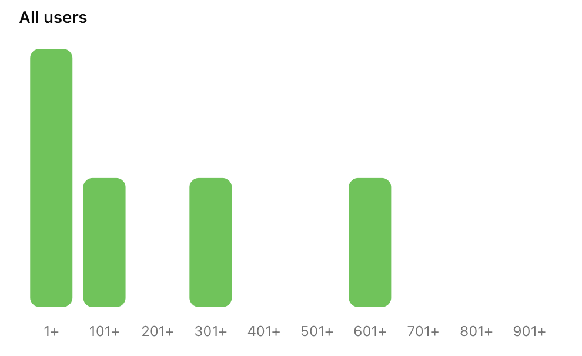

import MetricChangeResponseBlock from "/snippets/metric-change-response-block.mdx";

## What is a Points system?

Points systems are used to reward users for taking actions in your product. When rewards are closely aligned with user incentives, they can be a powerful retention feature.

<Tip>
  Use Trophy's [metric analytics](/platform/metrics#metric-analytics) to compare
  the retention of each user interaction, then configure points around these
  interactions to maximize retention impact.
</Tip>

Use Trophy to create sophisticated points systems driven by real user interactions with no custom code.

## Creating Points Systems

Trophy let's you set up multiple points systems for different use cases within your application.

<Frame>
  <video
    autoPlay
    muted
    loop
    playsInline
    className="w-full aspect-video"
    src="../assets/platform/points/create_system.mp4"
  ></video>
</Frame>

To create a points system, head to the [points page](https://app.trophy.so/points) and follow the steps below.

<Steps>
  <Step title="Hit New Points System">
    Give the new points system a name, and a unique key. The key is what you'll
    use to reference the points system in APIs and in email templates if
    relevant.
  </Step>
  <Step title="Add a description (Optional)">
    You can also give the points system a description which is returned from
    APIs to be displayed in your application.
  </Step>
  <Step title="Assign a badge (Optional)">
    You can also optionally upload a badge or logo to represent the points
    system. A `src` freindly URL to the image is returned from APIs for display
    in your application.
  </Step>
</Steps>

## Creating Triggers

You can add as many triggers as you like to each points system you set up in Trophy. This let's you create different logic for how points are awarded to users for different points systems.

Points can be awarded as a result of many different user interactions tracked by Trophy including:

- Awarding points as users increment [Metrics](/platform/metrics) e.g. "earn 10 points for every mile ran".
- Awarding points for reaching [Streak](/platform/streaks) milestones e.g. reaching 7-day, 14-day and 30-day streaks.
- Awarding points for unlocking [Achievements](/platform/achievements).

<Frame>
  <video
    autoPlay
    muted
    loop
    playsInline
    className="w-full aspect-video"
    src="../assets/platform/points/create_trigger.mp4"
  ></video>
</Frame>

To create a new points trigger, head to the points system that you want to create a trigger for and follow the steps below:

<Tip>
  All new points triggers are created as 'Inactive' to allow testing and
  balancing before deployment to production.
</Tip>

<Steps>
<Step title="Choose a trigger type">
  Choose how you want points to be awarded.
  
- Choosing **Metric** will mean points will be automatically awarded to users incrementally as they increase their metric total for a particular metric.

- Choosing **Streak** will mean points will be automatically awarded to users eaech time their streak is increased by a specific length.

- Choosing **Achievement** will mean points will be automatically awarded to users when they complete a specific achievement.

</Step>

<Step title="Set up trigger">
  Once you've chosen the points trigger type, you need to set up the trigger settings.

- If you chose the **Metric** trigger, you'll need to choose the metric, the threshold amount at which to award points, and number of points to award each time the user's total metric value increases by the threshold amount.

- If you chose the **Streak** trigger, you'll need to set the streak length that should award points and the number of points to award to user's each time their streak is increased by this length.

- If you chose the **Achievement** trigger, you'll need to choose the achievement that should award points when completed and the number of points to award.

</Step>

<Step title="Add attribute filters (Optional)">
  You can assign _attribute filters_ to a points trigger to further restrict when they apply.

- To limit a **Metric trigger** to only apply to events with specific [custom event attributes](/platform/events#custom-event-attributes), select an attribute and enter a value in the **Event Attribute** section.

- To limit any type of trigger to only apply to a user with one or more specific [custom user attributes](/platform/users#custom-user-attributes), add attributes and the desired values in the **User Attributes** section.

</Step>

<Step title="Hit save">
  Save the new points trigger.
</Step>
</Steps>

## Balancing Points

Running an effective points system requires finding the optimal pace at which users earn points. Too fast, and users will get points fatigue, rendering them useless. Too slow, and users may get bored and churn.

Trophy's preview tool can model different scenarios to help you determine how frequently users should earn points in each of your points systems.

<Frame>
  <video
    autoPlay
    muted
    loop
    playsInline
    className="w-full aspect-video"
    src="../assets/platform/points/points_preview.mp4"
  ></video>
</Frame>

## Displaying Points

There are a few ways to use Trophy to fetch and display points in your app.

<Frame>
  <video
    autoPlay
    muted
    loop
    playsInline
    className="w-full aspect-video"
    src="../assets/platform/points/displaying_points.mp4"
  ></video>
</Frame>

### Triggering Transactional UI

Firstly, any points awarded to users as a result of a metric change event are returned in the response when using the [metric change event API](/api-reference/endpoints/metrics/send-a-metric-change-event).

The response includes the user's new total points, how many points were awarded as a result of the event, and the details of the specific points triggers that fired.

<MetricChangeResponseBlock />

This makes it really simple to read the response and trigger any of the following transactional UI in your application:

- Displaying in-app notifications and pop-ups
- Playing sound effects

### Displaying User's Points

Trophy also has APIs that allow you fetch user's points data whenever you want.

First, the [user points API](/api-reference/endpoints/users/get-a-users-points) returns the user's total points for a particular points system and up to 100 of the most recent events that awarded points to the user.

You can use this API to display the user's total points anywhere in your platform as well as a 'Latest awards' section or similar.

<Frame>
  
</Frame>

Then, the [user points summary API](/api-reference/endpoints/users/get-a-users-points-summary) can be used to fetch historical points data for a particular user.

Data can be aggregated daily, weekly or monthly between a start and end date. Use this API to display points progress charts to users over any timeframe.

<Frame>
  
</Frame>

### Displaying Aggregate Data

Additionally there are a number of APIs that can be used to fetch and display points data at the account level.

First, the [points summary API](/api-reference/endpoints/points/get-points-summary) returns aggregate points system data across your entire user base.

Use this data to display a histogram of points for a particular points system and show users how they compare to others on the platform.

<Tip>
  This API can also be filtered to only return data for users with specifc
  [custom user attributes](/platform/users#custom-user-attributes).
</Tip>

<Frame>
  
</Frame>

Finally, the [points system API](/api-reference/endpoints/points/get-points) returns data about a particular points system, including all its triggers that award points to users.

Use this API to show users how they can earn points on your platform. Any new triggers you add will automatically be returned from this API helping to reduce code changes in your platform, and shifting operations to Trophy.

<Frame>
  
</Frame>

## Points Analytics

Trophy has built-in analytics to track points awards for each points system you configure across your users in real time including:

- Total points earned by all users over time
- Most points earned by a single user
- Average points earned in the first 14 days (useful for understanding new user retention patterns and the impact of points)
- A breakdown on the most commonly awarded points triggers

<Frame>
  
</Frame>

## Get Support

Want to get in touch with the Trophy team? Reach out to us via [email](mailto:support@trophy.so). We're here to help!
