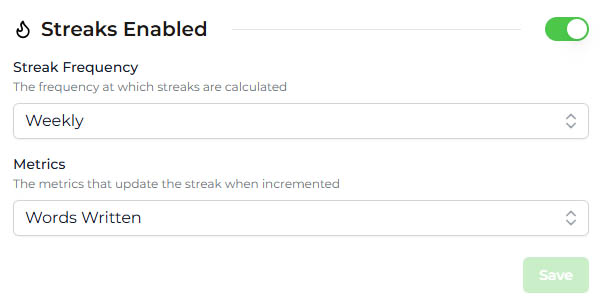

import MetricChangeResponseBlock from "/snippets/metric-change-response-block.mdx";

## What are Streaks?

A streak is a period of consecutive days, weeks or months that a user has performed a key action on your platform. Streaks have been shown to meaningfully increase retention, particularly when the user action being tracked aligns with the core value of your product.

Streaks are **global** to your platform, meaning that each user has a single streak that can be updated by incrementing [Metrics](/platform/metrics). You can decide which metrics should update a user's streak when incremented.

## Key Attributes

### Streak Frequency

Streaks can be configured to be daily, weekly or monthly. This means that a user must increment a metric at least once every calendar day, week or month to maintain their streak.

Trophy will automatically compute streak data for all streak frequencies, which means you can change the frequency at any time while maintaining users' streaks. Just note that changing the frequency may be confusing for users, and may lead to lost streaks (e.g. if you change from weekly to daily).

### Streak Metrics

You can choose which metrics should update a user's streak when incremented.

For example, if your platform is a language learning app, you might want to track a user's streak based on the number of lessons completed, while also tracking a metric for the number of words learned that doesn't affect the streak. In this case, you would set the lessons completed metric to update the user's streak.

<Callout intent="info">
  Regardless of whether streaks are enabled or disabled, Trophy will still
  compute all streak data. This means that you can enable streaks at any time
  and all your users' streak status will be immediately available, going back
  for as long as you've been using Trophy.
</Callout>

## Tracking Streaks

Trophy automatically calculates streaks for all users when users
[increment a metric](/platform/events#tracking-metric-events). There's no extra work required of you to track streaks, and you can start using them right away. Just make sure that streaks are enabled in the Trophy dashboard.

<Frame>
  
</Frame>

## Displaying Streaks

If you have [Emails](/platform/emails) configured, Trophy will automatically include streak information in the emails sent to users, as a means of encouraging users to keep using your product.

However, Trophy also returns streak data back to you to display in your app however you like. Trophy exposes streak data in two ways:

### Metric Event Response

When you [increment a metric](/platform/events#tracking-metric-events) for a user, the [Metric API](/api-reference/endpoints/metrics/send-a-metric-change-event) response will include the user's current
streak (if streaks are enabled).

<MetricChangeResponseBlock />

### User Streaks API

At any time, you can query the [User Streaks API](/api-reference/endpoints/users/get-a-users-streak).

This will return the current streak for a single user, along with their recent streak history. Use the [`historyPeriods`](/api-reference/endpoints/users/get-a-users-streak#parameter-history-periods) query parameter to control how many periods to return.

```json Response [expandable]
{
  "length": 1,
  "frequency": "weekly",
  "started": "2025-04-02",
  "periodStart": "2025-03-31",
  "periodEnd": "2025-04-05",
  "expires": "2025-04-12",
  "streakHistory": [
    {
      "periodStart": "2025-03-02",
      "periodEnd": "2025-03-08",
      "length": 9
    },
    {
      "periodStart": "2025-03-09",
      "periodEnd": "2025-03-15",
      "length": 0
    },
    {
      "periodStart": "2025-03-16",
      "periodEnd": "2025-03-22",
      "length": 0
    },
    {
      "periodStart": "2025-03-23",
      "periodEnd": "2025-03-29",
      "length": 1
    },
    {
      "periodStart": "2025-03-30",
      "periodEnd": "2025-04-05",
      "length": 2
    },
    {
      "periodStart": "2025-04-06",
      "periodEnd": "2025-04-12",
      "length": 3
    },
    {
      "periodStart": "2025-04-13",
      "periodEnd": "2025-04-19",
      "length": 4
    }
  ]
}
```

## Get Support

Want to get in touch with the Trophy team? Reach out to us via [email](mailto:support@trophy.so). We're here to help!
