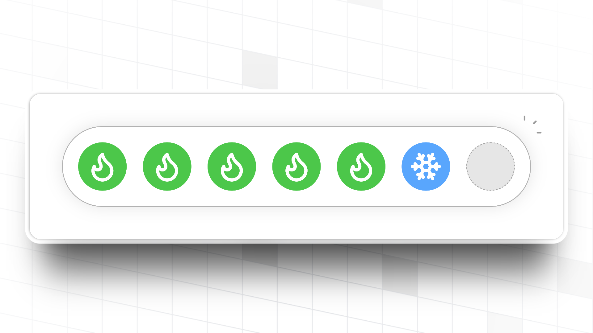
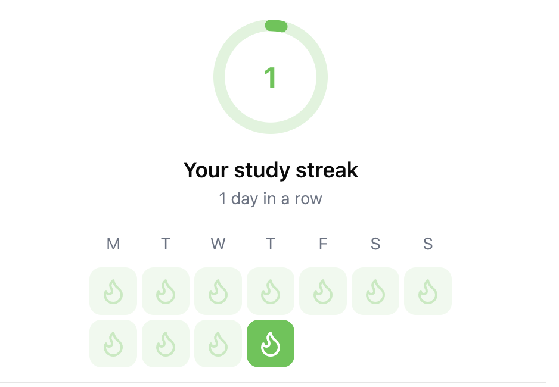

import MetricChangeResponseBlock from "/snippets/metric-change-response-block.mdx";

## What are Streaks?

A streak is a period of consecutive days, weeks or months that a user has performed a key action on your platform. Streaks have been shown to meaningfully increase retention, particularly when the user action being tracked aligns with the core value of your product.

<Tip>
  Use Trophy's [metric analytics](/platform/metrics#metric-analytics) to compare
  the retention of each user interaction, then configure streaks around these
  interactions to maximize retention impact.
</Tip>

Streaks are **global** to your platform, meaning that each user has a single streak across all interactions. You can decide which [Metrics](/platform/metrics) should contribute a user's streak on the [streaks configure](https://staging-app.trophy.so/streaks/configure) page.

## Streak Frequency

Streaks can be configured to be daily, weekly or monthly. This means that a user must increment a metric at least once every calendar day, week or month to maintain their streak.

Trophy will automatically compute streak data for all streak frequencies, which means you can change the frequency at any time while maintaining users' streaks. Just note that changing the frequency may be confusing for users, so best to communicate any changes ahead of time.

## Streak Metrics

You can choose which metrics should contribute to a user's streak

For example, if your platform is a language learning app, you might want to track a user's streak based on the number of lessons completed, while also tracking a metric for the number of words learned that doesn't affect streaks. In this case, you would configure the lessons completed metric to contribute to streak's but not the words learned metric.

<Callout intent="info">
  Regardless of whether streaks are enabled or disabled, Trophy will still
  compute all streak data. This means that you can enable streaks at any time
  and all your users' streak status will be immediately available, going back
  for as long as you've been using Trophy.
</Callout>

## Streak Freezes

Streak freezes help users keep their streaks for longer by allowing them to miss periods without it resetting to zero. This helps keep streaks motivating even if users don't maintain a perfect usage habit.

<Frame>
  
</Frame>

Streak freezes are optional in Trophy but can be configured on the [streaks page](https://app.trophy.so/streaks) of the Trophy dashboard.

### Granting Initial Freezes

You can configure any number of arbitrary freezes to grant to new users when you first identify them with Trophy.

Giving users too many freezes may decrease their perceived value, but granting too few freezes might result it a higher number of lost streaks.

<Tip>
  As a general rule of thumb, aim for the average user to have one or two
  freezes in their account in any given period to create a balanced experience.
</Tip>

### Freeze Accumulation

As users use up streak freezes, they'll need a continuous supply of new ones to keep them going. To facilitate this, Trophy can automatically grant streak freezes to users over time. You can choose an arbitrary number of days over which to grant an arbitrary number of freezes to each user.

If you've [configured time zones](/platform/users#param-tz) for your users, Trophy will automatically consume freezes at midnight in the user's time zone when necessary to extend their streak, and if any new freezes are due to be granted to a user, they will be granted up to ten minutes later.

### Maximum Freeze Count

In Trophy you also configure the maximum number of freezes that each user can have, up to a limit of 100. [Freeze accumulation](#freeze-accumulation) will only ever grant freezes up to this limit.

## Tracking Streaks

Trophy automatically calculates streaks for all users when users
[increment a metric](/platform/events#tracking-metric-events). There's no extra work required of you to track streaks, and you can start using them right away. Just make sure that streaks are enabled in the Trophy dashboard.

<Frame>
  
</Frame>

## Displaying Streaks

Trophy exposes streak data in two ways, which can be used to build UI elements within your applications and display streaks to users.

<Tip>
  Take a look at our [examples center](https://examples.trophy.so) for live
  demos of APIs in practice.
</Tip>

### Metric Event Response

When you [increment a metric](/platform/events#tracking-metric-events) for a user, the [metric API](/api-reference/endpoints/metrics/send-a-metric-change-event) response will include the user's current
streak.

<MetricChangeResponseBlock />

This can be used to transactionally trigger UI/UX elements including:

- Showing in-app pop-ups
- Playing sound effects

### User Streaks API

The [user streaks API](/api-reference/endpoints/users/get-a-users-streak) returns the current streak for a single user, along with their recent streak history. Use the [`historyPeriods`](/api-reference/endpoints/users/get-a-users-streak#parameter-history-periods) query parameter to control how many periods to return.

{/* vale off */}

```json Response [expandable]
{
  "length": 1,
  "frequency": "weekly",
  "started": "2025-04-02",
  "periodStart": "2025-03-31",
  "periodEnd": "2025-04-05",
  "expires": "2025-04-12",
  "rank": 5,
  "streakHistory": [
    {
      "periodStart": "2025-03-02",
      "periodEnd": "2025-03-08",
      "length": 9
    },
    {
      "periodStart": "2025-03-09",
      "periodEnd": "2025-03-15",
      "length": 0
    },
    {
      "periodStart": "2025-03-16",
      "periodEnd": "2025-03-22",
      "length": 0
    },
    {
      "periodStart": "2025-03-23",
      "periodEnd": "2025-03-29",
      "length": 1
    },
    {
      "periodStart": "2025-03-30",
      "periodEnd": "2025-04-05",
      "length": 2
    },
    {
      "periodStart": "2025-04-06",
      "periodEnd": "2025-04-12",
      "length": 3
    },
    {
      "periodStart": "2025-04-13",
      "periodEnd": "2025-04-19",
      "length": 4
    }
  ]
}
```

{/* vale on */}

Use this data to display a user's streak history within your application.

<Frame>
  
</Frame>

### List Multiple User's Streaks

If you want to display streaks for multiple users at once, for example to support a friend streak or user group feature, then use the [list user streaks API](/api-reference/endpoints/streaks/get-streaks).

```json [expandable]
[
  {
    "userId": "user-123",
    "streakLength": 15,
    "extended": "2025-01-01T05:03:00Z"
  },
  {
    "userId": "user-456",
    "streakLength": 12,
    "extended": "2025-01-01T08:43:00Z"
  },
  {
    "userId": "user-789",
    "streakLength": 0,
    "extended": null
  }
]
```

### Streak Rankings

You can also use the [streak rankings API](/api-reference/endpoints/streaks/get-streak-rankings) to get a list of up to the top 100 users by streak length and display a streak leaderboard in your application.

You can fetch rankings either for 'active' streaks (users on a streak at the time of request), or 'longest' (ranking each users longest ever streak).

```json [expandable]
[
  {
    "userId": "user-123",
    "name": "Alice Johnson",
    "streakLength": 15
  },
  {
    "userId": "user-456",
    "name": "Bob Smith",
    "streakLength": 12
  },
  {
    "userId": "user-789",
    "name": "Charlie Brown",
    "streakLength": 8
  }
]
```

## Get Support

Want to get in touch with the Trophy team? Reach out to us via [email](mailto:support@trophy.so). We're here to help!
