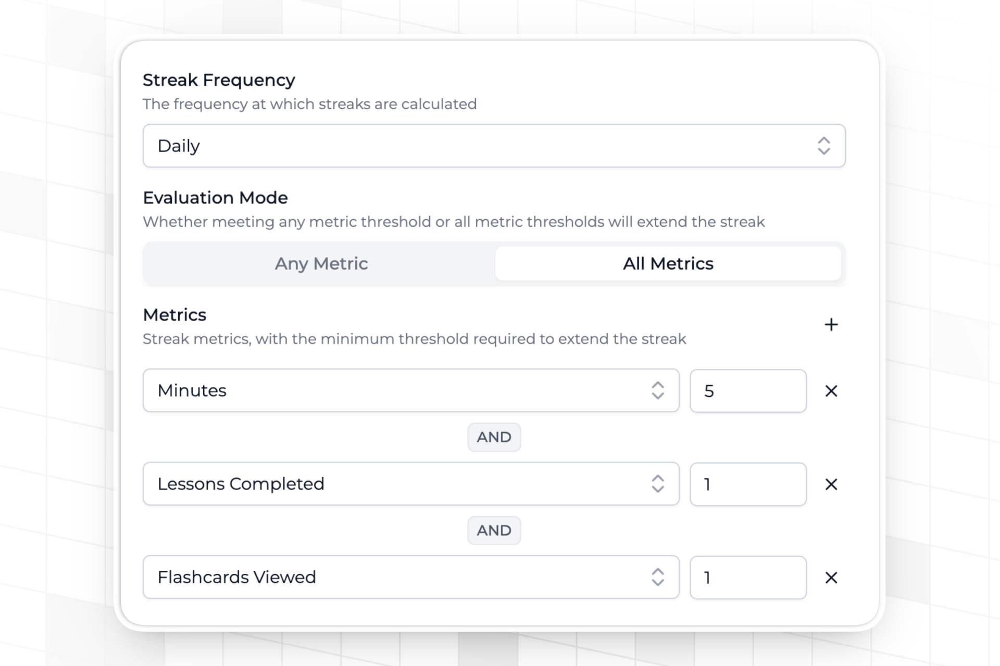
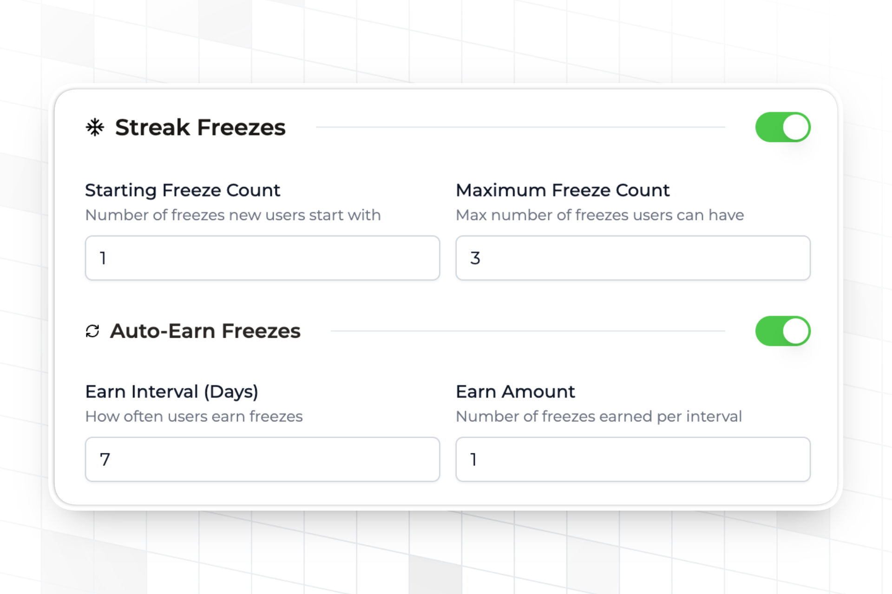
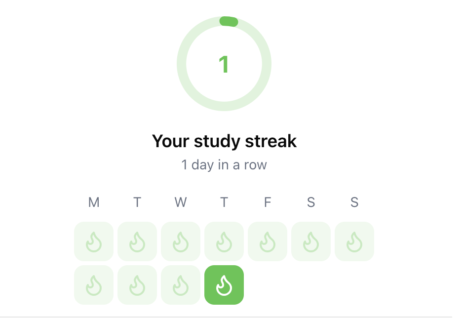

import MetricChangeResponseBlock from "../snippets/metric-change-response-block.mdx";

## What are Streaks? {#what-are-streaks}

A streak is a period of consecutive days, weeks or months that a user has performed a key action on your platform. Streaks have been shown to meaningfully increase retention, particularly when the user action being tracked aligns with the core value of your product.

## Streak Frequency {#streak-frequency}

Streaks in Trophy can be **daily, weekly or monthly**. This means that a user must meet their [streak conditions](#streak-conditions) at least once every calendar day, week or month to maintain their streak.

If you've [configured time zones](/platform/users#param-tz) for your users, Trophy will automatically track each user's streak in their local time zone (including taking into account when users change time zones) and keep streaks in tact.

<Note>
Trophy automatically computes streak data for every streak frequency, meaning you can switch at any time.
</Note>

## Streak Conditions {#streak-conditions}

In Trophy you can set the thresholds that a user must meet in order to extend their streak based on your configured [Metrics](/platform/metrics).

You can choose which metrics should be part of your streak, and for those that you chose, you can set a custom threshold that users must meet.

<Frame>
  
</Frame>

When combining metrics in this way, you can choose between two evaluation modes:
- `ALL` means a user must meet every metric threshold to extend their streak
- `OR` means a user only has to meet one of your metric thresholds to extend their streak

In this way you can design your streak logic to match your application use case.

## Streak Freezes {#streak-freezes}

Streak freezes help users keep their streaks for longer by allowing them to miss periods without it resetting to zero. This helps keep streaks motivating even if users don't maintain a perfect usage habit.

<Frame>
  
</Frame>

Streak freezes are optional in Trophy but can be configured on the [streaks page](https://app.trophy.so/streaks) of the Trophy dashboard.

### Granting Initial Freezes {#granting-initial-freezes}

You can configure any number of arbitrary freezes to grant to new users when you first identify them with Trophy.

<Tip>
Giving users too many freezes may decrease their perceived value, but granting too few freezes might result it a higher number of lost streaks. A good starting point is one freeze per user, but the trick is to experiment!
</Tip>

### Freeze Accumulation {#freeze-accumulation}

As users use up streak freezes, they'll need a continuous supply of new ones to keep them going. To facilitate this, Trophy can automatically grant streak freezes to users over time. You can choose an arbitrary number of days over which to grant an arbitrary number of freezes to each user.

If you've [configured time zones](/platform/users#param-tz) for your users, Trophy will automatically consume freezes at midnight in the user's time zone when necessary to extend their streak, and if any new freezes are due to be granted to a user, they will be granted up to ten minutes later.

### Maximum Freeze Count {#maximum-freeze-count}

In Trophy you also configure the maximum number of freezes that each user can have, up to a limit of 100. [Freeze accumulation](#freeze-accumulation) will only ever grant freezes up to this limit.

## Tracking Streaks {#tracking-streaks}

Trophy automatically calculates streaks for all users based on the [metric events](/platform/events#tracking-metric-events) you report to Trophy.

There's no extra work required to track streaks, and you can start using them right away. Just make sure that streaks are enabled in the Trophy dashboard.

<Tip>
For a full walk through on how to set up a streak feature using Trophy, check out our [official guide](/guides/how-to-build-a-streaks-feature).
</Tip>

## Managing Streaks {#managing-streaks}

This section outlines some of the operations you can perform to manage user's streaks in your application.

### Restoring A Users Streak {#restoring-a-users-streak}

To restore a user's streak, head to the user details page and use the 'Restore Streak' action. Restoring a user's streak sets it to the length it was when they last lost it.

<Tip>
You can also use the [restore streak admin API](/admin-api/endpoints/streaks/restore-streaks) to restore streaks programmatically.
</Tip>

<Frame>
  <video
    autoPlay
    muted
    loop
    playsInline
    className="w-full aspect-15/4"
    src="../assets/platform/streaks/restoring_streaks.mp4"
  ></video>
</Frame>

## Displaying Streaks {#displaying-streaks}

Trophy exposes streak data in two ways, which can be used to build UI elements within your applications and display streaks to users.

<Tip>
  Check out our [full guide](/guides/how-to-build-a-streaks-feature) on adding a
  streaks feature to your app for more details.
</Tip>

### Metric Event Response {#metric-event-response}

When you [increment a metric](/platform/events#tracking-metric-events) for a user, the [metric API](/api-reference/endpoints/metrics/send-a-metric-change-event) response will include the user's current
streak.

<MetricChangeResponseBlock />

This can be used to transactionally trigger UI/UX elements including:

- Showing in-app pop-ups
- Playing sound effects

### User Streaks API {#user-streaks-api}

The [user streaks API](/api-reference/endpoints/users/get-a-users-streak) returns the current streak for a single user, along with their recent streak history. Use the `historyPeriods` query parameter to control how many periods to return.

{/* vale off */}

```json Response [expandable]
{
  "length": 1,
  "frequency": "weekly",
  "started": "2025-04-02",
  "periodStart": "2025-03-31",
  "periodEnd": "2025-04-05",
  "expires": "2025-04-12",
  "rank": 5,
  "streakHistory": [
    {
      "periodStart": "2025-03-02",
      "periodEnd": "2025-03-08",
      "length": 9
    },
    {
      "periodStart": "2025-03-09",
      "periodEnd": "2025-03-15",
      "length": 0
    },
    {
      "periodStart": "2025-03-16",
      "periodEnd": "2025-03-22",
      "length": 0
    },
    {
      "periodStart": "2025-03-23",
      "periodEnd": "2025-03-29",
      "length": 1
    },
    {
      "periodStart": "2025-03-30",
      "periodEnd": "2025-04-05",
      "length": 2
    },
    {
      "periodStart": "2025-04-06",
      "periodEnd": "2025-04-12",
      "length": 3
    },
    {
      "periodStart": "2025-04-13",
      "periodEnd": "2025-04-19",
      "length": 4
    }
  ]
}
```

{/* vale on */}

Use this data to display a user's streak history within your application.

<Frame>
  
</Frame>

### List Multiple User's Streaks {#list-multiple-users-streaks}

If you want to display streaks for multiple users at once, for example to support a friend streak or user group feature, then use the [list user streaks API](/api-reference/endpoints/streaks/get-streaks).

```json [expandable]
[
  {
    "userId": "user-123",
    "streakLength": 15,
    "extended": "2025-01-01T05:03:00Z"
  },
  {
    "userId": "user-456",
    "streakLength": 12,
    "extended": "2025-01-01T08:43:00Z"
  },
  {
    "userId": "user-789",
    "streakLength": 0,
    "extended": null
  }
]
```

## Get Support {#get-support}

Want to get in touch with the Trophy team? Reach out to us via [email](mailto:support@trophy.so). We're here to help!
