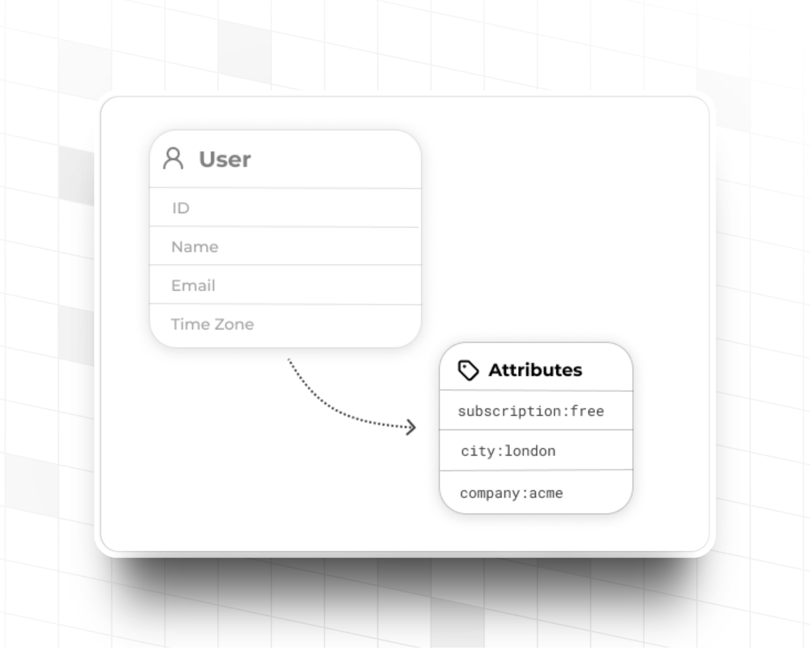
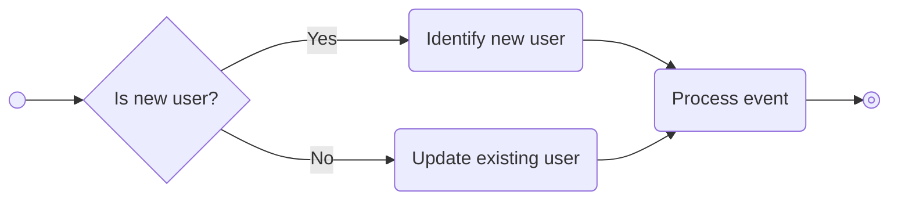
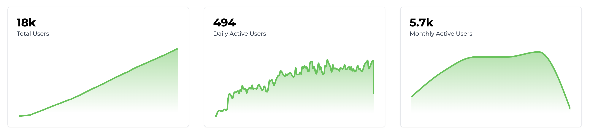
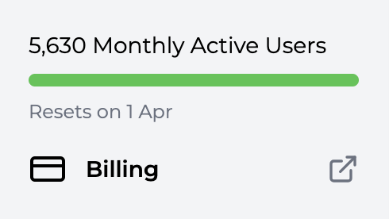

import MetricChangeRequestBlock from "/snippets/metric-change-request-block.mdx";
import IdentifyUserRequestBlock from "/snippets/identify-user-request-block.mdx";

## What are Users?

Users are the individual people that use your product. You tell Trophy about your users through APIs and use the dashboard to design gamification experiences around them.

Users must be individuals, they cannot be companies or organisations. To create organizational structures or user groupings, consider using a [custom user attribute](#custom-user-attributes).

## Key Attributes

Key attributes are properties of users controlled and managed by Trophy and are for things like `id` or `email`, some are required while others are optional.

### Required Attributes

Trophy only requires one key attribute, `id`. Every user you tell Trophy about must have an `id`, this is what identifies them as a unique person.

<ParamField path="id" type="string" required={true}>
  This is the ID of the user in **your** database.
</ParamField>

<Tip>
  To make things simple, Trophy lets you use your own `id` that you already have
  in your database instead of needing to manage another one just for Trophy.
</Tip>

### Optional Attributes

Additionally, you can tell Trophy about any of the following optional key attributes and it will make them available to you as part of your gamification experience:

<ParamField path="name" type="string">
  The user's full name. This is accessible in email templates and other areas
  where you may want to address the user by name.
</ParamField>

<ParamField path="email" type="string">
  The user's email address. This address will be used in any
  [Emails](/platform/emails) that you set up as part of your gamification
  experience with Trophy.
</ParamField>

<ParamField path="tz" type="string">
  The user's time zone. Must be specified as an [IANA timezone
  identifier](https://en.wikipedia.org/wiki/List_of_tz_database_time_zones).
  Used for streaks, leaderboard rankings and sending emails to users in
  accordance with their local clock.
</ParamField>

<ParamField path="subscribeToEmails" type="boolean" default="true">
  If you've configured any Trophy [Emails](/platform/emails), then they'll only
  be sent to a user when this field is true. Note: If you don't provide an
  `email`, attempting to set this field to true will result in an error.
</ParamField>

## Custom User Attributes

<Frame>
  
</Frame>

Custom user attributes are managed by you and can be anything you like based on your use case.

For example a language learning app might use a custom user attribute for the language a user is learning, or a study platform might use one for the users favourite subject.

Custom user attributes let you tell Trophy about this contextual information and use it to personalize gamification features.

### Creating Attributes

To create a new custom user attribute, head to the [attributes tab](https://app.trophy.so/users/attributes) of the users page in the Trophy dashboard and hit the _Add User Attribute_ button.

Give the attribute a name and a unique key. The key is what you'll use to reference the attribute in API calls.

<Frame>
  <video
    autoPlay
    muted
    loop
    playsInline
    className="w-full aspect-15/4"
    src="../assets/platform/users/create_custom_user_attribute.mp4"
  ></video>
</Frame>

### Setting Attributes

Attributes can be assigned values for specific users using their unique key either inline, as users increment metrics through the [metric increment API](/api-reference/endpoints/metrics/send-a-metric-change-event), or explicity through the [user identification](/api-reference/endpoints/users/identify-a-user), [create user](/api-reference/endpoints/users/create-a-user), or [update user](api-reference/endpoints/users/update-a-user) APIs.

<Warning>
  Trophy will only set values of attributes that have first been created
  in the dashboard. We do this to help you keep a clean set of attributes and
  prevent accidental overwrites.

If you receive an error similar to the following then you might have miss-spelled the attribute key in the request, or you need to create the attribute first in the Trophy dashboard:

```json
{
  "error": "Invalid attribute keys: pln. Please ensure all attribute keys match those set up at https://app.trophy.so/users/attributes."
}
```

</Warning>

Across all APIs, the schema for setting attribute values is consistent. Here's an example of a request payload that sets the value of two custom user attributes `subject` and `plan`:

```json {4-7}
{
  "name": "Joe Bloggs",
  "email": "joe.bloggs@example.com",
  "attributes": {
    "subject": "physics",
    "plan": "free"
  }
}
```

### Using Attributes

Use custom user attributes across Trophy to personalize gamification features , aggregate and filter data returned from APIs, and to segment and compare user cohorts in analytics.

#### Feature Personalization

Custom user attributes can be used to personalize achievements, customize the way points are earned by different users and more. Follow the links to the relevant pages below to learn more.

<CardGroup>
  <Card
    title="Personalizing Achievements"
    icon="trophy"
    href="/platform/achievements#creating-achievements"
  >
    Configure achievements that can only be unlocked by specific users.
  </Card>
  <Card
    title="Personalizing Points"
    icon="sparkle"
    href="/platform/points#creating-triggers"
  >
    Personalize how different users earn points.
  </Card>
  <Card
    title="Email Segmentation"
    icon="split"
    href="/platform/emails#limiting-emails-to-specific-types-of-users"
  >
    Control which users receive gamified emails.
  </Card>
  <Card
    title="Email Personalization"
    icon="trophy"
    href="/platform/emails#email-variables"
  >
    Personalize email copy and subject lines with custom user attributes.
  </Card>
</CardGroup>

#### Data Aggregation and Filtering

You can use custom user attributes to aggregate and filter data returned from some APIs to support a wide range of gamification use cases. In all cases, attributes are included in the `userAttributes` query parameter using a consistent schema:

`?userAttributes=city:london,subscription-plan:pro`

Here's a list of all APIs that support the `userAttributes` query parameter:

- [Points Summary](/api-reference/endpoints/points/get-points-summary)

#### Segmented Analytics

Custom user attributes can be used to segment and compare retention and engagement charts between user groups.

This is useful to understand which cohorts are making full use of your gamification features, and which are struggling to engage and therefore require some attention.

<Frame>
  <video
    autoPlay
    muted
    loop
    playsInline
    className="w-full aspect-15/4"
    src="../assets/platform/users/segmenting_analytics.mp4"
  ></video>
</Frame>

## Identifying Users

When you tell Trophy about a user in your platform, we call this **identification**. There are two ways you can identify users with Trophy, [inline](#inline-identification) and [explicit](#explicit-identification) identification.

<Tip>
  We recommend getting started with inline identification if you're new to
  Trophy. If you decide you need more control, try explicit identification.
</Tip>

### Inline Identification

Inline identification is the easiest way of telling Trophy about your users as it doesn't require any specific user identification code. You simply tell Trophy about users as they go about normal use of your platform.

In practice this means whenever you use the [Metric Event API](/api-reference/endpoints/metrics/send-a-metric-change-event), you pass along full details of the user who triggered the event.

Here's an example where an API call is made to the metric events API, and the details of the user who made the interaction are passed along in the request body:

<MetricChangeRequestBlock />

In this case, if this is the user's first interaction (i.e. they are a new user) then a new record will be created for them in Trophy automatically.

However if Trophy finds an existing record with the same `id`, then Trophy will update any details of the user that are passed through.

In other words, inline identification is by means of an `UPSERT` operation.

<br />



<br />

Identifying users in this way has two key benefits:

- All new users that sign up for your platform and increment a metric are automatically tracked in Trophy without any explicit identification code written by you
- Any changes to existing user properties like name or email address are automatically synced to Trophy the next time the user increments a metric

In this way inline identification allows you to keep your entire userbase in constant sync with Trophy with the least amount of code required by you.

This is why we recommend starting with inline identification first, then exploring explicit identification if you discover you need more control.

### Explicit Identification

Explicit identification is when you write code in your application that explicitly tells Trophy about users seperate from any metric interactions. This is useful if you want complete control over how and when Trophy learns about your users.

Scenarios where you might want to use explicit identification might be:

- You want to tell Trophy about new users immediately on sign-up, before they increment a metric
- You track a lot of metrics in Trophy, and don't want to repeat inline identification code.
- You want to only tell Trophy about a specific cohort of users, of which you control the conditions around

In this case, you can tell Trophy about new users using the [User Identification API](/api-reference/endpoints/users/identify-a-user).

<IdentifyUserRequestBlock />

<Tip>
  Just like in inline identification, explicit identifcation also works by means
  of an `UPSERT` operation meaning all user attributes are kept in sync with
  Trophy automatically.
</Tip>

## Creating Users

To explicitly create a new user in Trophy, use the [Create User API](/api-reference/endpoints/users/create-a-user).

## Keeping Users Up To Date

To tell Trophy about an update to a user in your platform you can use the [Update User API](/api-reference/endpoints/users/update-a-user).

Any properties that you pass to Trophy will be updated to the new values you specify.

<Tip>
  As [user identifcation](#identifying-users) keeps user records up to date by
  default, it's usually not neccesary to explicitly update users in Trophy every
  time one of their properties changes in your application. However the user
  update API is there if you really need it.
</Tip>

## Retrieving User Information

To fetch the details of a user that you've already identified with Trophy, use the [Get User API](/api-reference/endpoints/users/get-a-single-user).

This will return the full details of the user along with the `control` attribute that you can use to conditionally enroll users in any gamification features. Learn more about [Experimentation](/experimentation/overview).

```json Response {3}
{
  "id": "user-id",
  "control": false,
  "created": "2021-01-01T00:00:00Z",
  "email": "user@example.com",
  "name": "User",
  "subscribeToEmails": true,
  "tz": "Europe/London",
  "updated": "2021-01-01T00:00:00Z"
}
```

## User Analytics

### Basic Analytics

By default Trophy includes high-level user analytics including on the [Users page](https://app.trophy.so/users) including:

- The total number of users that you've told Trophy about
- The number of users that are active on a daily basis
- The number of users that are active on a monthly basis

<Frame>
  
</Frame>

On this page you can also search through every user that Trophy has recorded, which can be useful for debugging.

### Top Users

Additionally, on the [Dashboard](https://app.trophy.so), Trophy shows a _Top Users_ list with the set of users who have made the most progress against your platform's metrics.

These are your most engaged users, so it's useful to know who they are!

## Frequently Asked Questions

<AccordionGroup>
  <Accordion title="How many users can I tell Trophy about?">
    As many as you want! Trophy only charges each month for _active_ users, which are the users that interact with your product at least once in a given month.

    This is great because it means if a user churns, you won't pay for them in subsequent months.

    You can view the total number of users you'll be charged for each month within Trophy on the sidebar:

    <Frame>
      
    </Frame>

    You can estimate your usage costs on our [Pricing page](https://trophy.so/pricing).

  </Accordion>

</AccordionGroup>

## Get Support

Want to get in touch with the Trophy team? Reach out to us via [email](mailto:support@trophy.so). We're here to help!
