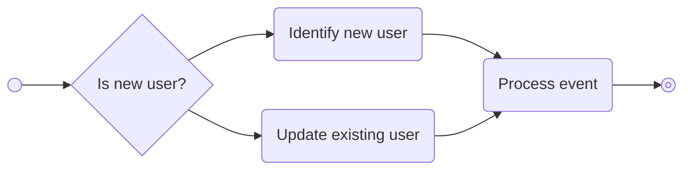

import MetricChangeRequestBlock from "/snippets/metric-change-request-block.mdx";
import IdentifyUserRequestBlock from "/snippets/identify-user-request-block";

## User Attributes

Users in Trophy have a number of attributes, some are required while others are optional. Here we look at the different attributes and how to use them.

### Key Attributes

Every user you tell Trophy about must have an `id`, this is what identifies them as a unique person.

To make things simple, Trophy lets you use your own id that you already have in your database instead of needing to manage another one just for Trophy.

<ParamField path="id" type="string" required={true}>
  This is the ID of the user in **your** database.
</ParamField>

### Optional Attributes

Additionally, you can tell Trophy about any of the following key attributes and it will make them available to you as part of your gamification experience:

<ParamField path="name" type="string">
  The user's full name. This is accessible in email templates and other areas
  where you may want to address the user by name.
</ParamField>

<ParamField path="email" type="string">
  The user's email address. This address will be used in any
  [Emails](/platform/emails) that you set up as part of your gamification
  experience with Trophy.
</ParamField>

<ParamField path="tz" type="string">
  The user's time zone. Must be specified as an [IANA timezone
  identifier](https://en.wikipedia.org/wiki/List_of_tz_database_time_zones).
  Used to calculate streaks and send emails to users in accordance with their
  local clock.
</ParamField>

## Identifying Users

When you tell Trophy about a User in your platform, we call this **identification**. There are two ways you can identify users with Trophy, [inline](#inline-identification) and [explicit](#explicit-identification) identification.

<Tip>
  We recommend getting started with inline identification if you're new to
  Trophy. If you decide you need more control, try explicit identification.
</Tip>

### Inline Identification

Inline identification is the easiest way of telling Trophy about your users as it doesn't require any specific user identification code. You simply tell Trophy about users as they go about normal use of your platform.

In practice this means whenever you use the [Metric Event API](/api-reference/endpoints/metrics/send-a-metric-change-event), you pass along full details of the user who triggered the event.

Here's an example where an API call is made to the metric events API, and the details of the user who made the interaction are passed along in the request body:

<MetricChangeRequestBlock />

In this case, if this is the user's first interaction (i.e. they are a new user) then a new record will be created for them in Trophy automatically.

However if Trophy finds an existing record with the same `id`, then Trophy will update any details of the user that are passed through.

<br />



<br />

Identifying users in this way has two key benefits:

- All new users that sign up for your platform and increment a metric are automatically tracked in Trophy without any explicit identification code written by you
- Any changes to existing user properties like name or email address are automatically synced to Trophy the next time the user increments a metric

In this way inline identification allows you to keep your entire userbase in constant sync with Trophy with the least amount of code required by you.

This is why we recommend starting with inline identification first, then exploring explicit identification if you discover you need more control.

### Explicit Identification

Explicit identification is when you write code in your application that explicitly identifies users and updates their attributes, and is useful if you want complete control over how and when that happens.

Scenarios where you might want to use explicit identification might be:

- You want to tell Trophy about new users immediately on sign-up, before they increment a metric
- You want to only tell Trophy about a specific cohort of users, of which you control the conditions around
- The system that manages your users is seperate to the system you want to gamify using Trophy

In this case, you can tell Trophy about new users using the [User Identification API](/api-reference/endpoints/users/identify-a-new-user).

<IdentifyUserRequestBlock />

<Tip>
  Even if you use explicit identification, the metrics API will always create
  new and update existing users to ensure your whole userbase is always tracked.
</Tip>

## Keeping Users Up To Date

To tell Trophy about an update to a user in your platform you can use the [Update User API](/api-reference/endpoints/users/update-a-user).

Any properties that you pass to Trophy will be updated to the new values you specify.

## Retrieving User Information

To fetch the details of a user that you've already identified with Trophy, use the [Get User API](/api-reference/endpoints/users/get-a-single-user).

This will return the full details of the user along with the `control` attribute that you can use to conditionally enroll users in any gamification features. Learn more about [Experimentation](/experimentation/overview).

```json Response
{
  "id": "user-id",
  "control": false,
  "created": "2021-01-01T00:00:00Z",
  "email": "user@example.com",
  "name": "User",
  "subscribeToEmails": true,
  "tz": "Europe/London",
  "updated": "2021-01-01T00:00:00Z"
}
```

## User Analytics

### Basic Analytics

By default Trophy includes high-level user analytics including on the [Users page](https://app.trophy.so/users) including:

- The total number of users that you've told Trophy about
- The number of users that are active on a daily basis
- The number of users that are active on a monthly basis

<Frame>
  
</Frame>

On this page you can also search through every User that Trophy has recorded, which can be useful for debugging.

### Top Users

Additionally, on the [Dashboard](https://app.trophy.so), Trophy shows a _Top Users_ list with the set of users who have made the most progress against your platform's metrics.

These are your most engaged users, so it's useful to know who they are!

## Frequently Asked Questions

<AccordionGroup>
  <Accordion title="How many users can I tell Trophy about?">
    As many as you want! Trophy only charges each month for _active_ users, which are the users that interact with your product at least once in a given month.

    This is great because it means if a user churns, you won't pay for them in subsequent months.

    You can view the total number of users you'll be charged for each month within Trophy on the sidebar:

    <Frame>
      
    </Frame>

    You can estimate your usage costs on our [Pricing page](https://trophy.so/pricing).

  </Accordion>

</AccordionGroup>

## Get Support

Want to get in touch with the Trophy team? Reach out to us via [email](mailto:support@trophy.so). We're here to help!
