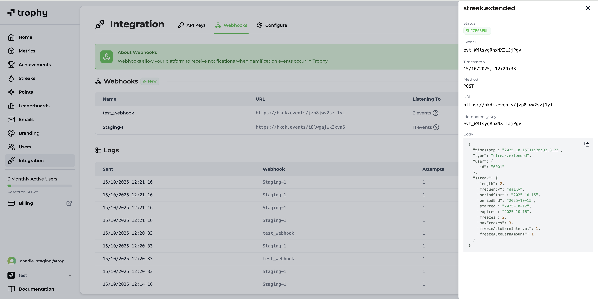

## Monitoring Webhook Delivery

The Trophy dashboard has built-in analytics for all webhook events sent to your endpoints, including viewing the status of sent events and the payload.

<Frame>
  
</Frame>

## Data Retention

Trophy retains all webhook logs for **7 days**. If you would like to discuss increasing your data retention window, please [get in touch](mailto:support@trophy.so) and we'll happily discuss it with you.

## Get Support

Want to get in touch with the Trophy team? Reach out to us via [email](mailto:support@trophy.so). We're here to help!
